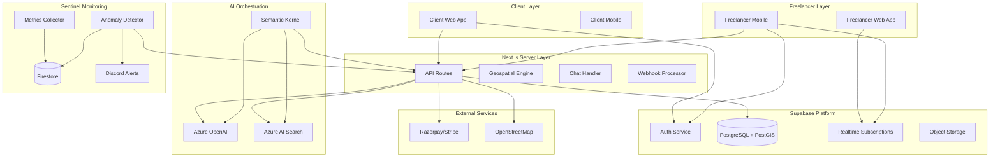
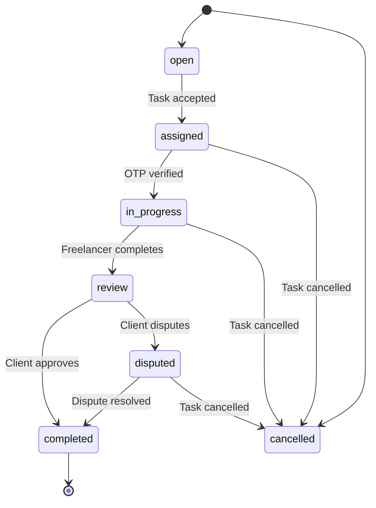

# TalentFlow PRT - Detailed Architecture Report

## 1. System Overview

TalentFlow PRT (Personalized Resource Tasker) is an intent-driven P2P marketplace that connects clients with verified student freelancers within customizable geospatial radii. The platform leverages AI agents for intent extraction, semantic matching, and automated negotiation, replacing traditional search/filter UI with an agentic dispatching system.

### Core Features:
- **Intent-Driven Matching**: LLM-powered natural language understanding
- **Hybrid Search**: PostGIS geospatial filtering + Azure AI Search semantic re-ranking
- **Autonomous Dispatcher**: Semantic Kernel orchestrates agentic workflows
- **Geospatial Matching**: PostGIS-powered customizable radius task discovery
- **Real-time Updates**: Supabase Realtime for live task notifications
- **OTP Verification**: In-app 4-digit OTP for task start/end
- **Verification System**: Tiered commission (10% verified vs 50% unverified)
- **Privacy-First Location**: Fuzzy location display before task acceptance
- **Circuit Breaker**: Fallback to keyword search if LLM intent parsing fails

## 2. Technology Stack

### Frontend & Framework:
- **Framework**: Next.js 14 (App Router)
- **Language**: TypeScript
- **Styling**: Tailwind CSS
- **UI Components**: Radix UI + Lucide React icons
- **State Management**: Zustand

### Backend & Database:
- **Database**: Supabase (PostgreSQL + PostGIS)
- **Auth**: Supabase Auth
- **Realtime**: Supabase Realtime
- **Storage**: Supabase Storage
- **Serverless Functions**: Next.js API Routes

### AI & Machine Learning:
- **LLM**: Azure OpenAI
- **Vector Search**: Azure AI Search
- **Orchestration**: Semantic Kernel (Python SDK)
- **Validation**: Pydantic AI

### Monitoring & Observability:
- **Sentinel-Node**: Self-hosted SRE agent with active inference
- **Metrics Collection**: Firebase Cloud Functions + Firestore
- **Anomaly Detection**: Statistical modeling with surprise score calculation
- **Alerting**: Discord webhooks

### External Services:
- **Maps**: OpenStreetMap (no API key)
- **Payments**: Razorpay/Stripe (placeholder)

## 3. System Architecture

### High-Level Architecture Diagram



## 4. Database Architecture

### Core Tables

#### 1. profiles (User Profiles)
Stores user data with verification status and location.

**Key Fields**:
- `id`: UUID (primary key)
- `user_id`: UUID (foreign key to auth.users)
- `email`, `role`, `full_name`, `phone`, `city`
- `verification_status`: 'none' | 'pending' | 'verified'
- `college_id_url`, `gov_id_url`, `college_name`
- `skills`: JSONB array
- `commission_rate`: integer (10% verified, 50% unverified)
- `location`: PostGIS geography(POINT, 4326)
- `completed_tasks`, `average_rating`

#### 2. tasks (Job Postings)
Core task table with mode and category support.

**Key Fields**:
- `id`: UUID (primary key)
- `client_id`: UUID (foreign key to profiles)
- `title`, `description`
- `mode`: 'immediate' | 'standard'
- `category`: 7 predefined categories (content_engine, hyper_local_logistics, tech_neighbor, academic_support, event_support, ai_training, digital_assistant)
- `budget`, `escrow_amount`
- `geo_location`: PostGIS geography(POINT, 4326)
- `status`: 'open' | 'assigned' | 'in_progress' | 'review' | 'completed' | 'disputed' | 'cancelled'
- `is_nearby`: boolean (for geospatial filtering)

#### 3. task_handshakes (Direct Assignments)
Handles first-accept locking mechanism for Mode A tasks.

#### 4. task_applications (Freelancer Proposals)
For Mode B (Standard) task proposals.

#### 5. chats & messages (Real-time Communication)
Chat rooms and individual messages with safety filtering.

#### 6. task_attachments (Proof of Work)
Files attached to tasks or messages.

#### 7. reviews (Task Reviews)
Task completion reviews and ratings.

#### 8. sos_alerts (Emergency Alerts)
Emergency alerts for active tasks.

#### 9. otps (One-Time Passwords)
Task start/end OTP verification codes.

### Key Database Functions

#### find_nearby_tasks()
PostGIS-powered radius search for nearby tasks.

#### get_fuzzy_location()
Privacy-preserving location offset (200m random offset).

#### increment_completed_tasks()
Updates freelancer stats on task completion.

#### update_freelancer_rating()
Recalculates average rating after new reviews.

#### handle_new_user()
Auto-creates profile on user signup.

### Indexes & Performance

```sql
-- Geospatial indexes for fast location-based queries
CREATE INDEX idx_profiles_location ON profiles USING GIST(location);
CREATE INDEX idx_tasks_geo ON tasks USING GIST(geo_location);

-- Status and role indexes
CREATE INDEX idx_profiles_role ON profiles(role);
CREATE INDEX idx_tasks_status ON tasks(status);
CREATE INDEX idx_tasks_client ON tasks(client_id);

-- Foreign key indexes
CREATE INDEX idx_task_handshakes_task ON task_handshakes(task_id);
CREATE INDEX idx_task_applications_task ON task_applications(task_id);
CREATE INDEX idx_chats_task ON chats(task_id);
CREATE INDEX idx_messages_chat ON messages(chat_id);
CREATE INDEX idx_reviews_task ON reviews(task_id);
```

## 5. API Architecture

### API Routes Structure

```
app/
├── api/
│   ├── tasks/
│   │   ├── nearby/route.ts       # GET - Find nearby tasks
│   │   ├── accept/route.ts       # POST - Accept immediate task (race-safe)
│   │   ├── status/route.ts       # POST - Update task status with OTP
│   │   └── otp/route.ts          # POST/GET - OTP generation/verification
│   ├── agent/                    # Agentic orchestration
│   ├── vector/                   # Azure AI Search integration
│   └── trust/                    # Freelancer trust scores
```

### Key API Endpoints

#### Tasks API

| Endpoint | Method | Description |
|----------|--------|-------------|
| `/api/tasks/nearby` | GET | Find tasks within specified radius |
| `/api/tasks/accept` | POST | Accept an immediate task (race-safe) |
| `/api/tasks/status` | POST | Update task status with OTP validation |
| `/api/tasks/otp` | POST | Generate 4-digit OTP |
| `/api/tasks/otp` | GET | Verify OTP code |

#### Example: Nearby Tasks Query

```typescript
// GET /api/tasks/nearby?lat=28.6139&lng=77.2090&radius=5000
interface NearbyTasksResponse {
  tasks: Array<{
    id: string;
    title: string;
    budget: number;
    category: string;
    mode: string;
    distance_meters: number;
    client: {
      full_name: string;
      average_rating: number;
      verification_status: string;
    };
  }>;
  verification_status: string;
}
```

### API Middleware

#### Sentinel Monitoring Integration

All API routes are wrapped with Sentinel sensor middleware:

```typescript
import { withSentinelHandler } from '@sentinel/sensor';

async function handler(request: Request) {
  // Handler logic
}

export const GET = withSentinelHandler(handler);
```

## 6. Client Architecture

### Pages Structure

#### Client Pages
- `/auth/login` - Login page
- `/auth/signup` - Signup with role selection
- `/client/dashboard` - Client task management
- `/client/tasks/create` - Task creation form
- `/client/tasks/[taskId]` - Task details & management
- `/client/profile` - Client profile

#### Freelancer Pages
- `/freelancer/dashboard` - Active tasks & OTP verification
- `/freelancer/nearby-tasks` - Radius-based task discovery
- `/freelancer/all-tasks` - All available tasks
- `/freelancer/applications` - Mode B applications
- `/freelancer/profile` - Freelancer profile & verification

#### Shared Features
- `/messages/[chatId]` - Real-time chat
- `/debug` - Debug information

### Key Components

#### UI Components (src/components/ui)
- Avatar, Badge, Button
- Card, Input, Modal
- Progress, Stats, Toast

#### Custom Hooks (src/hooks)
- `useNetworkStatus` - Network connectivity monitoring
- `useRealtimeTasks` - Real-time task subscriptions

#### Utilities (src/lib/utils)
- `geo.ts` - Geospatial calculations
- `otp.ts` - OTP generation
- `safety.ts` - Content safety filtering
- `commission.ts` - Commission calculation

## 7. Sentinel Monitoring System

### Architecture

Sentinel-Node is a self-hosted SRE agent that regulates the application using active inference.

```
┌──────────────────────────────────────────────────────────────────┐
│                      Cybernetic SRE Agent                        │
├──────────────────────────────────────────────────────────────────┤
│                                                                  │
│  ┌──────────────┐    ┌──────────────┐    ┌──────────────┐       │
│  │  Sensor      │───▶│  Brain       │───▶│  Actuator    │       │
│  │  (Nervous    │    │  (Governor)  │    │  (Muscles)   │       │
│  │  System)     │    │              │    │              │       │
│  └──────────────┘    └──────────────┘    └──────────────┘       │
│         │                     │                     │            │
│         ▼                     ▼                     ▼            │
│  ┌──────────────┐    ┌──────────────┐    ┌──────────────┐       │
│  │  Firestore   │    │  Hourly      │    │  Webhooks    │       │
│  │  (Memory)    │    │  Profiles    │    │  (Actions)   │       │
│  └──────────────┘    └──────────────┘    └──────────────┘       │
│                                                                  │
└──────────────────────────────────────────────────────────────────┘
```

### Core Packages

#### @sentinel/sensor (Nervous System)
- Telemetry collection middleware for Next.js
- 60-second moving window aggregator
- Batches metrics before writing to Firestore
- Captures: latency, errors, request counts, database metrics

#### @sentinel/brain (Governor)
- Active Inference engine for anomaly detection
- Calculates "surprise" score based on deviation from normal behavior
- Classifies anomalies and suggests remediation
- Implements Layer 4 (Executive) of the 6-Layer Autonomous Framework

#### @sentinel/core (Shared Types)
- Core type definitions for metrics, anomalies, and configurations
- Constants and thresholds for anomaly detection

### Anomaly Detection

#### Surprise Score Calculation

The system calculates a "surprise" score based on metrics deviation:

```typescript
S = -ln(P(observation | model))
```

**Thresholds**:
- **S < 0.4**: Normal operation
- **0.4 ≤ S < 0.7**: Warning - anomaly detected
- **S ≥ 0.7**: Critical - immediate attention needed

#### Anomaly Types

1. `latency_spike` - High P95/P99 latency
2. `error_rate_high` - >5% error rate
3. `db_slow_queries` - Database queries exceeding threshold
4. `connection_exhaustion` - Database connection pool near capacity
5. `memory_pressure` - High memory usage
6. `state_desync` - State desynchronization between services
7. `cache_miss_high` - High cache miss rate
8. `request_rate_anomaly` - Abnormal request rate pattern

#### Remediation Actions

| Anomaly Type | Suggested Action | Risk Level | Impact |
|--------------|------------------|------------|--------|
| latency_spike | Cache flush | Low | Clears stale cache entries |
| error_rate_high | Restart service | Medium | Graceful restart of API |
| db_slow_queries | DB vacuum & analyze | Medium | Optimizes database tables |
| connection_exhaustion | Connection pool reset | High | Resets all active connections |
| memory_pressure | Clear old logs | Low | Frees disk space |
| state_desync | Socket pulse | Low | Forces client resync |
| cache_miss_high | Cache flush + warmup | Low | Clears and warms cache |
| request_rate_anomaly | Scale up API instances | High | Increases infrastructure cost |

## 8. Security Architecture

### Authentication & Authorization

- **Supabase Auth**: Email/password authentication
- **JWT Tokens**: Session management with short-lived access tokens
- **Role-Based Access Control**:
  - Clients: Can create and manage tasks
  - Freelancers: Can view and accept tasks
  - Verification gate for nearby task acceptance

### Row Level Security (RLS)

All tables have RLS enabled with policies:

```sql
-- Profiles: Users manage own profile
CREATE POLICY "Users update own profile" ON profiles FOR UPDATE USING (auth.uid() = user_id);

-- Tasks: Clients manage own, open tasks public
CREATE POLICY "Clients manage own tasks" ON tasks FOR ALL USING (
    EXISTS (SELECT 1 FROM profiles WHERE user_id = auth.uid() AND id = client_id)
);
CREATE POLICY "Open tasks viewable" ON tasks FOR SELECT USING (status = 'open');

-- OTPs: Visible only to task participants
CREATE POLICY "Participants view otps" ON otps FOR SELECT USING (
    task_id IN (
        SELECT id FROM tasks WHERE client_id IN (SELECT id FROM profiles WHERE user_id = auth.uid())
        UNION ALL 
        SELECT task_id FROM task_handshakes WHERE freelancer_id IN (SELECT id FROM profiles WHERE user_id = auth.uid())
    )
);
```

### Content Safety

- **Phone number masking**: `9876543210` → `98xxxxxx10`
- **Email masking**: `user@email.com` → `u***@email.com`
- **Safety flagging**: Suspicious content detection
- **OTP system**: 4-digit codes with 30-minute expiry

### Location Privacy

- **Fuzzy location**: 200m random offset before task acceptance
- **Exact location**: Revealed only after handshake
- **Geospatial queries**: PostGIS ST_DWithin with radius constraints

## 9. Real-time Features

### Supabase Realtime Subscriptions

```typescript
// Subscribe to nearby tasks
supabase
  .channel('nearby-tasks')
  .on(
    'postgres_changes',
    {
      event: 'INSERT',
      schema: 'public',
      table: 'tasks',
      filter: `is_nearby=eq.true`,
    },
    (payload) => {
      // Check distance and notify if within 5km
      checkDistanceAndNotify(payload.new);
    }
  )
  .subscribe();
```

### Real-time Chat

- Chat sessions created automatically on task acceptance
- Messages synced in real-time using Supabase Realtime
- Safety filtering applied to all messages
- Typing indicators and read receipts

## 10. Task Lifecycle Management

### Status Transitions



### OTP Verification Flow

#### Generate Start OTP

```typescript
// Client generates OTP
POST /api/tasks/otp
{
  "taskId": "uuid",
  "otpType": "start"
}

// Response
{
  "otp": "1234",
  "otpType": "start",
  "expiresAt": "2024-01-01T10:30:00Z"
}
```

#### Verify OTP to Start Task

```typescript
// Freelancer verifies OTP
GET /api/tasks/otp?taskId=uuid&otp=1234&otpType=start

// Response
{
  "valid": true,
  "message": "OTP is valid"
}

// Then update status
POST /api/tasks/status
{
  "taskId": "uuid",
  "newStatus": "in_progress",
  "otp": "1234"
}
```

## 11. Verification System

### Tiered Commission Structure

| Verification Status | Commission |
|---------------------|------------|
| Verified (College ID + Government ID) | 10% |
| Unverified | 50% |

### Verification Process

1. User uploads college ID and government ID
2. System creates verification request
3. Admin reviews and approves/rejects
4. Verification status updated
5. Commission rate automatically adjusted

## 12. Performance Optimization

### Query Optimization

- PostGIS spatial indexes for fast location queries
- Materialized views for frequently accessed data
- Query caching with Redis (planned)
- Database connection pooling

### Frontend Optimization

- Static generation for landing pages
- Incremental static regeneration for dynamic content
- Image optimization with Next.js Image
- Code splitting and lazy loading

### Caching Strategy

- API response caching with SWR
- Client-side caching with Zustand
- CDN caching for static assets
- Redis cache for frequent queries (planned)

## 13. Deployment Architecture

### Hosting

- **Frontend**: Vercel (Serverless)
- **Backend**: Vercel (Next.js API Routes)
- **Database**: Supabase (PostgreSQL + PostGIS)
- **Monitoring**: Firebase Cloud Functions + Firestore
- **Storage**: Supabase Storage

### Environment Configuration

```env
# Supabase
NEXT_PUBLIC_SUPABASE_URL=https://your-project.supabase.co
NEXT_PUBLIC_SUPABASE_ANON_KEY=your-anon-key
SUPABASE_SERVICE_ROLE_KEY=your-service-role-key

# Azure AI Services
AZURE_AI_SEARCH_ENDPOINT=https://your-search-service.search.windows.net
AZURE_AI_SEARCH_KEY=your-search-key
AZURE_OPENAI_ENDPOINT=https://your-openai-resource.openai.azure.com
AZURE_OPENAI_API_KEY=your-api-key

# Firebase (Sentinel)
FIREBASE_PROJECT_ID=your-project-id
DISCORD_WEBHOOK_URL=https://discord.com/api/webhooks/...
ACTUATOR_URL=http://localhost:3001
```

## 14. Scalability & Reliability

### Horizontal Scaling

- Serverless architecture auto-scales with traffic
- Database connection pooling
- Redis caching for frequent queries
- Content delivery via CDN

### Reliability Features

- Circuit breaker pattern for API failures
- Retry logic for transient errors
- Graceful degradation of features
- Monitoring and alerting system

### Backup & Recovery

- Daily database backups
- Point-in-time recovery (PITR)
- Storage replication
- Disaster recovery plan

## 15. Future Roadmap

### Phase 1 - Knowledge Vectorization & RAG (In Progress)
- Ingest freelancer bios and categories into Azure AI Search
- Implement Hybrid Search (PostGIS + Vector)

### Phase 2 - Reasoning Dispatcher Agent
- Semantic Kernel orchestration
- Intent extraction from natural language
- Negotiation agent for trust/load checking

### Phase 3 - Execution Skill/Plugin Registry
- Convert Supabase API routes into Semantic Kernel Skills
- Implement function calling for autonomous task execution

### Phase 4 - Governance Autonomous IDP
- Azure OpenAI Vision for automated ID verification
- HIPAA/Security-compliant logic

## 16. Conclusion

TalentFlow PRT represents a modern, agentic approach to P2P task matching with:

1. **AI-Driven Core**: LLM-powered intent extraction and semantic matching
2. **Privacy-First Design**: Fuzzy location, content safety, and data protection
3. **Real-time Experience**: Live task notifications and chat
4. **Robust Monitoring**: Active inference-based anomaly detection
5. **Scalable Architecture**: Serverless design with auto-scaling
6. **Comprehensive Security**: RLS, OTP verification, and safety filtering

The platform balances automation with human oversight, providing a seamless experience for both clients and freelancers while maintaining high standards of security and reliability.