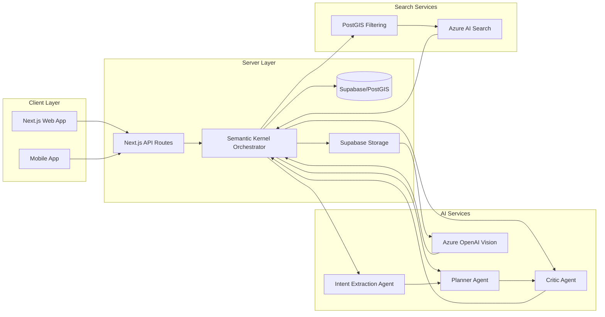

# TalentFlow PRT Implementation Plan

## Project Overview
**Project Name**: TalentFlow PRT: The Autonomous Service Mesh  
**Goal**: Transition from manual P2P marketplace to agentic dispatching system  
**Timeline**: 9 weeks total implementation  
**Current State**: MVP1 completed with core features  

## Implementation Phases

### Phase 1: Foundation Hardening (Weeks 1-2)
**Objective**: Strengthen existing architecture for agentic system

#### Week 1 - Database Schema Improvements
- [ ] Add `review_pending` status to `task_status` enum
- [ ] Modify `task_handshakes` table to add `UNIQUE(task_id)` constraint
- [ ] Add `escrow_status` field to `tasks` table with possible values: 'unlocked', 'locked', 'released'
- [ ] Add `bio` field to `profiles` table for semantic search
- [ ] Add `trust_score` (0-100) field to `profiles` table
- [ ] Add `current_load` (0-100) field to `profiles` table

#### Week 2 - Security Enhancements
- [ ] Configure Supabase Storage with private buckets for ID verification
- [ ] Implement signed URL generation for time-limited access
- [ ] Modify verification workflow to use async processing
- [ ] Add secure API endpoints for verification
- [ ] Implement safety checks for ID document handling

### Phase 2: Agentic Orchestration (Weeks 3-5)
**Objective**: Implement Semantic Kernel orchestration system

#### Week 3 - Semantic Kernel Setup
- [ ] Set up Python environment for Semantic Kernel
- [ ] Create kernel instance with Azure OpenAI integration
- [ ] Implement base kernel configuration
- [ ] Create initial set of skills

#### Week 4 - Intent Extraction Agent
- [ ] Implement intent extraction from natural language
- [ ] Create prompt templates for intent recognition
- [ ] Implement Pydantic validation for extracted intent
- [ ] Add fallback to keyword search if intent extraction fails
- [ ] Create `/api/agent` endpoint to handle intent requests

#### Week 5 - Planner-Critic Pattern
- [ ] Implement planner agent for task planning
- [ ] Create critic agent for validation
- [ ] Add business rule validation (radius > 0, valid category, budget constraints)
- [ ] Implement error handling for invalid intent

### Phase 3: Hybrid Search System (Weeks 6-7)
**Objective**: Implement PostGIS + Azure AI Search hybrid search

#### Week 6 - Azure AI Search Integration
- [ ] Create Azure AI Search service and index
- [ ] Implement document upload functionality
- [ ] Create embedding generation for freelancer profiles
- [ ] Implement vector search capabilities

#### Week 7 - Waterfall Search Algorithm
- [ ] Optimize `/api/tasks/nearby` endpoint with waterfall approach
- [ ] First filter strictly by PostGIS radius
- [ ] Then re-rank using Azure AI Search semantic scoring
- [ ] Finally apply agentic filtering (trust score, current load)
- [ ] Implement hybrid search API endpoint

### Phase 4: Autonomous IDP & Finalization (Weeks 8-9)
**Objective**: Complete the autonomous dispatching system

#### Week 8 - Autonomous ID Verification
- [ ] Implement Azure OpenAI Vision for automated ID verification
- [ ] Create specialized ID verification skill
- [ ] Add async processing for ID verification
- [ ] Implement confidence score tracking
- [ ] Add manual review fallback for low confidence cases

#### Week 9 - Escrow & Dispute Resolution
- [ ] Implement escrow status management
- [ ] Create dispute resolution API endpoints
- [ ] Add UI for handling disputes
- [ ] Implement fund movement logic: unlocked → locked → released
- [ ] Test escrow and dispute resolution workflows

## System Architecture Diagram



## Technical Stack
- **Framework**: Next.js 14 (App Router)
- **Language**: TypeScript
- **Styling**: Tailwind CSS
- **Database**: Supabase (PostgreSQL + PostGIS)
- **Auth**: Supabase Auth
- **Realtime**: Supabase Realtime
- **Storage**: Supabase Storage (Private Buckets)
- **Maps**: OpenStreetMap (no API key needed)
- **Payments**: Razorpay/Stripe (placeholder)
- **Orchestrator**: Semantic Kernel (Python SDK)
- **Vector Engine**: Azure AI Search (Hybrid: Vector + Keyword)
- **LLM**: Azure OpenAI
- **Validation**: Pydantic AI

## Key Features to Implement

### Intent-Driven Matching
- Natural language understanding replaces traditional search
- Intent extraction with fallback to keyword search

### Hybrid Search
- PostGIS hard filtering by radius
- Azure AI Search semantic re-ranking
- Agentic filtering by trust score and current load

### Autonomous Dispatcher
- Semantic Kernel orchestrates agentic workflows
- Planner-Critic pattern for reliability
- Circuit breaker mechanism for failures

### Enhanced Verification
- Azure OpenAI Vision for automated ID verification
- Private bucket storage with signed URLs
- Confidence score-based verification

### Escrow & Dispute Resolution
- Escrow status management
- Dispute resolution workflow
- Fund movement tracking

## API Endpoints to Create

### Agentic API
```typescript
// POST /api/agent
interface AgentRequest {
  intent: string;
  user_id: string;
}

interface AgentResponse {
  intent_summary: string;
  parameters: any;
  actions: Action[];
  confidence: number;
}

interface Action {
  type: 'DISPATCH_MODE_A' | 'UI_FEEDBACK' | 'ERROR';
  target_ids?: string[];
  message?: string;
}
```

### Vector Search API
```typescript
// POST /api/vector/search
interface VectorSearchRequest {
  query: string;
  radius: number;
  lat: number;
  lng: number;
}

interface VectorSearchResponse {
  results: FreelancerMatch[];
}
```

### Verification API
```typescript
// POST /api/verification/id
interface IDVerificationRequest {
  file_url: string;
  user_id: string;
}

interface IDVerificationResponse {
  is_valid: boolean;
  confidence_score: number;
  verified_data?: any;
}
```

## Database Changes

### Updated Profiles Table
```sql
ALTER TABLE profiles ADD COLUMN bio TEXT;
ALTER TABLE profiles ADD COLUMN trust_score INTEGER DEFAULT 0;
ALTER TABLE profiles ADD COLUMN current_load INTEGER DEFAULT 0;
```

### Updated Tasks Table
```sql
ALTER TYPE task_status ADD VALUE 'review_pending';
ALTER TABLE tasks ADD COLUMN escrow_status TEXT DEFAULT 'unlocked' CHECK (escrow_status IN ('unlocked', 'locked', 'released'));
```

### Updated Task Handshakes Table
```sql
ALTER TABLE task_handshakes ADD CONSTRAINT unique_task_id UNIQUE (task_id);
```

## Performance Optimization

### Search Performance
- PostGIS spatial indexes for radius queries
- Azure AI Search pre-computed embeddings
- Caching of frequent search results

### Agent Performance
- Semantic Kernel memory management
- Azure OpenAI request batching
- Fallback to keyword search

### Database Performance
- Connection pooling
- Query optimization for frequent operations
- Indexing of frequently queried fields

## Security Measures

### Data Protection
- Private bucket storage with signed URLs
- Encrypted sensitive data
- Role-based access control (RLS)

### Content Safety
- Safety filtering for chat messages
- OTP verification for task start/end
- Location privacy with fuzzy display

### API Security
- Rate limiting
- Input validation
- Error handling with minimal information leakage

## Testing Strategy

### Unit Testing
- Test individual components and functions
- Test API endpoints in isolation

### Integration Testing
- Test API integration with frontend
- Test database interactions

### End-to-End Testing
- Test complete user workflows
- Test agentic dispatching
- Test dispute resolution

### Performance Testing
- Load testing for search endpoints
- Stress testing for agentic workflows
- Geospatial query performance testing

## Deployment Strategy

### Development Environment
- Local development with Supabase local instance
- Azure OpenAI development endpoint
- Testing with mock data

### Staging Environment
- Supabase staging project
- Azure AI Search staging index
- User acceptance testing (UAT)

### Production Environment
- Supabase production project
- Azure AI Search production index
- Load balancing and monitoring

## Success Metrics

### User Engagement
- Number of active users
- Task completion rate
- User satisfaction score

### Performance
- Search response time
- Agent dispatch time
- API throughput

### Business Metrics
- Commission revenue
- Task volume
- Verified user growth

## Risks & Mitigation

### Technical Risks
- **Azure API rate limits**: Implement caching and batching
- **Database performance**: Optimize queries and indexes
- **Agent reliability**: Fallback to keyword search

### Business Risks
- **User adoption**: Launch with targeted university partnerships
- **Trust issues**: Transparent verification process
- **Payment disputes**: Clear policies and dispute resolution

### Mitigation Strategies
- Comprehensive error handling
- Regular performance monitoring
- User feedback collection
- Data-driven improvements

## Documentation

### Developer Documentation
- API documentation with examples
- Database schema documentation
- Deployment instructions
- Codebase structure guide

### User Documentation
- Platform usage guide
- Verification process explanation
- Payment and commission details
- Dispute resolution instructions

## Conclusion

The TalentFlow PRT implementation plan outlines a structured approach to transition from a manual P2P marketplace to an agentic dispatching system. The plan focuses on reliability, security, and user trust, with phased implementation to minimize risk. By leveraging cutting-edge technologies like Semantic Kernel, Azure AI Search, and Azure OpenAI Vision, TalentFlow PRT will offer a unique value proposition in the hyper-local student freelance marketplace.
